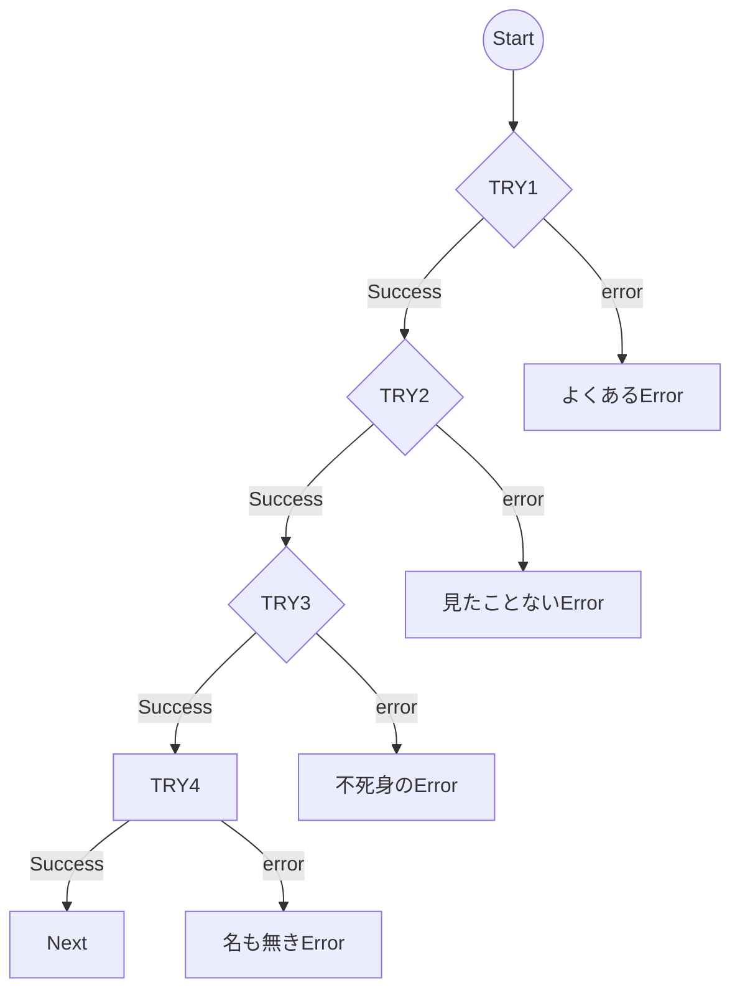
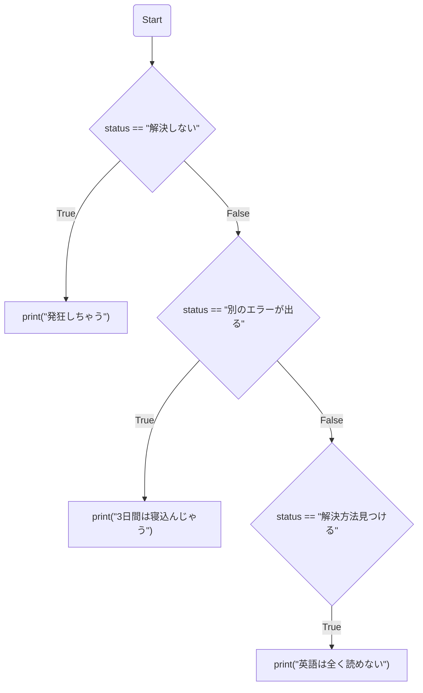

# Neko Hacker - Endless Error Loop feat. ななひら

---

```
TRY / EXCEPT
    よくあるError
TRY / EXCEPT
    見たことないError
TRY / EXCEPT
    不死身のError
TRY / EXCEPT
    名も無きError
```



---
```
if status == "解決しない":
  print("発狂しちゃう")
elif status == "別のエラーが出る":
  print("3日間は寝込んじゃう")
elif status == "解決方法見つける":
  print("英語は全く読めない")
```


---
